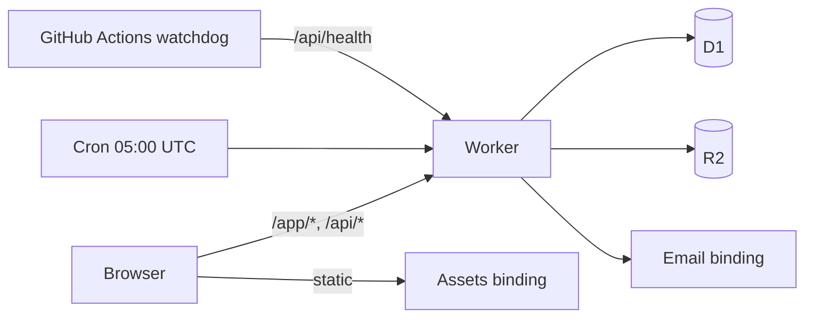

# Architecture

## 1. Overview

One Cloudflare Worker serves everything: a small public landing page, a login-only app, and a JSON
API. Data lives in D1 (SQLite), files in R2, and mail goes out through Cloudflare Email Routing.
There is no build step, no framework and no runtime dependency.

| Component | Directory | Responsibility |
| --------- | --------- | -------------- |
| Router and cron | `src/worker.js` | Matches routes; runs the three nightly passes |
| Route groups | `src/api/` | One module per area, each exporting `routes` |
| Queries | `src/db/queries.js` | Every SQL statement in the project |
| Auth | `src/auth/` | Sessions, one-time codes, WebAuthn verification |
| Survival checks | `src/ops/` | What the site can learn about its own continuation |
| Reminders | `src/events/` | Birthday, anniversary and gathering mail |
| Backup | `src/backup/` | SQL dump and a streaming ZIP writer |
| Mail | `src/mail.js` | Every message the site sends, in two languages |
| App | `public/app/` | Browser modules; views under `views/` |

## 2. Inbound API

All routes are `/api/*`. Everything except `/api/health` and the login routes needs a session
cookie. Path parameters are `([A-Za-z0-9_-]+)`.

| Area | Routes |
| ---- | ------ |
| Auth | `POST /auth/email`, `/auth/code/request`, `/auth/code`, `/auth/logout`, `/auth/passkey/challenge`, `/auth/passkey/login`, `/auth/passkey/step-up` |
| Self | `GET/PATCH /me`, `GET/POST /me/passkeys`, `PATCH/DELETE /me/passkeys/:id`, `GET /me/sessions`, `DELETE /me/sessions/:id`, `POST /me/sessions/revoke-all`, `GET/PATCH /me/person`, `PUT /me/person/avatar` |
| People | `GET /people`, `GET /people/:id`, `GET /people/:id/avatar`, `GET /people/:id/media` |
| Media | `POST /media`, `GET/PATCH/DELETE /media/:id`, `GET/PUT /media/:id/thumb` |
| Gathering | `GET /gatherings`, `PUT /gatherings/:id/rsvp` |
| Gathering (admin) | `POST /admin/gatherings`, `PATCH`/`DELETE /admin/gatherings/:id`, `PUT /admin/gatherings/:id/rsvp/:personId`, `POST /admin/gatherings/:id/announce`, `POST /admin/gatherings/:id/nudge` |
| News | `GET /news` |
| Join | `POST /join/request`, `POST /join/confirm` |
| Health | `GET /health` — public |
| Admin | accounts, invitations, join requests, people and relationships, history, backup, gatherings (see `src/api/admin*.js`, `backup.js`, `gatherings.js`) |

`GET /api/me` carries `tz` alongside the account: the site's zone, so the browser works out
"today" exactly as the cron does rather than from whatever zone the reader's laptop is in.

`GET /api/health` is deliberately public and deliberately tiny: `{ok, checks_stale}`. It lets an
outside watchdog tell "the Worker and its database are alive" from "DNS still resolves", without
holding a session or learning anything.

## 3. Outbound integrations

| Integration | Where | Notes |
| ----------- | ----- | ----- |
| Cloudflare Email Routing | `EMAIL` binding, `src/mail.js` | Login codes, invitations, reminders, the monthly survival letter. Without a verified sender nobody can sign in. |
| Cloudflare Billing API | `src/ops/checks.js` | `/user/billing/profile` is deprecated with no replacement; it is the **secondary** alarm. The dashboard's own notifications are primary. |

## 4. Security and auth

- **Two ways in:** a one-time code by mail, or a passkey (WebAuthn, verified in-house in
  `src/auth/webauthn.js` — no library). Sessions are opaque tokens in an `HttpOnly` cookie.
- **Step-up:** destructive admin routes require a *fresh* passkey assertion, not merely an admin
  role (`requireAdmin`). Administrative-but-not-destructive routes use `requireRole`.
- **Privacy is editorial, not technical.** Everyone signed in sees everything; nothing sensitive is
  put in in the first place. The news feed and the gathering payload carry no addresses.
- **The founder** (`accounts.founder`) is fixed: they cannot be demoted, only they may protect
  another admin, and only their invitations speak in the first person.
- IP addresses in the history log are stored hashed (`src/history.js`, `IP_HASH_SECRET`).

## 5. Scheduled work

One cron, 05:00 UTC, three independent passes in `src/worker.js`, each in its own `waitUntil` so one
failing cannot take the others with it:

| Pass | Module | Does |
| ---- | ------ | ---- |
| `runDaily` | `events/cron.js` | Birthday and anniversary mail at T−7 and T−0, scope-checked |
| `runOps` | `ops/daily.js` | Writes `ops_status`: domain, card, backup age, warnings |
| `gatheringReminders` | `events/cron.js` | Gathering mail a week before and on the day |

Both mail passes guard against a cron that fires twice by reading the history rows they themselves
write, keyed by day — the site's day, resolved through `SITE_TZ`, not the trigger's UTC one. A
repeated run mails nobody twice.

## 6. Data model

D1, migrations `0001`–`0010` in `src/db/migrations/`, append-only.

| Table | Holds |
| ----- | ----- |
| `accounts` | Who may sign in; role, language, reminder opt-in, `founder`, `protected` |
| `sessions`, `passkeys`, `login_codes` | Authentication state |
| `people` | The tree: names, dates, `deceased`, optional address |
| `parent_of`, `partner_of`, `person_links` | Relationships and external links |
| `avatars` | Portrait JPEGs, stored as blobs in D1 |
| `media`, `media_people` | Photographs and documents in R2; owner, and tags that are pointers not ownership |
| `invitations`, `join_requests` | Getting in |
| `history` | Append-only log; the news feed is a filtered view of it |
| `ops_status` | One row: what the site last learned about its own survival |
| `gatherings`, `rsvps` | The gathering, and one answer per **person** |

Two decisions worth knowing:

- **An RSVP is keyed by person, not by account.** Most of a family will never sign in, so an answer
  that could only hang off an account would leave the guest list permanently wrong. `answered_by`
  records who entered it.
- **Media ownership is capped per person (6) and enforced by the INSERT itself**, not by a count
  read beforehand — two simultaneous uploads would otherwise both pass.
- **`gatherings.announced_at` and `nudged_at` make each mail-out unrepeatable.** Announcing writes to
  every living relative with an address and creates an invitation for anyone without an account;
  nudging reaches only those who have not answered. Both refuse a second attempt with `409`, and
  neither can be sent for a cancelled gathering. Deleting a gathering removes its answers but leaves
  the history rows that record it existed.

## 7. Configuration

Everything site-specific is in `wrangler.toml`, which is **git-ignored**. `wrangler.example.toml` is
the tracked template and is what the tests run against.

| Var | Meaning |
| --- | ------- |
| `APP_ORIGIN` | The site's origin. Everything else derives from it: WebAuthn RP id, links in mail |
| `MAIL_LOGIN_FROM`, `MAIL_FAMILY_FROM` | Senders for codes and for family mail. Optional: left out, they default to `login@` and `rodzina@` at `APP_ORIGIN`'s host |
| `SITE_TZ` | The family's zone, and the site's only answer to "what is today". Falls back to `UTC`, which is nobody's midnight: set it |
| `DB_NAME`, `BUCKET_NAME`, `REPO_URL` | Named in the restore instructions inside every backup |
| `DOMAIN_RENEWS_AT` | Registrar renewal date; warns 45 days out, says so plainly when empty |

Bindings: `DB` (D1), `MEDIA` (R2), `ASSETS`, `EMAIL`. Secrets: `IP_HASH_SECRET`, `CF_BILLING_TOKEN`.

## 8. Backup and recovery

`GET /api/admin/backup` streams the whole archive as one ZIP: the database as plain SQL, every file
and thumbnail from R2, and restore instructions. It is written by hand in `src/backup/` — no
dependency, auditable in one sitting.

Two hard-won details:

- The dump skips `sqlite_*` and `_cf_*` tables. A real D1 carries `_cf_KV`, which answers
  `SQLITE_AUTH` to any read; walking into it aborted the archive on its first byte and handed the
  admin a 0-byte file. **Local D1 is not a faithful stand-in for remote D1.**
- `backup_at` is written only in the stream's `flush()`, so it records an archive that finished, not
  one that started. A failure records its time and reason instead, and raises a warning.

## 9. Testing

`vitest` + `@cloudflare/vitest-pool-workers`, against real D1 and R2. `tests/helpers/env.js` builds
the environment and a stub `EMAIL` binding that records messages. Tests read
`wrangler.example.toml`, never a real configuration.

No DOM environment exists, so view code in `public/app/views/` is not render-tested; logic that
deserves tests lives in importable modules instead.

## 10. References

- Cloudflare Workers, D1, R2 and Email Routing documentation
- `DEVELOPER_GUIDE.md` for setup, secrets and troubleshooting
