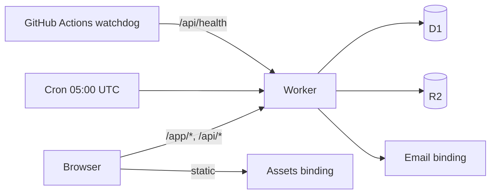

# Architecture

## 1. Overview

One Cloudflare Worker serves everything: a small public landing page, a login-only app, and a JSON
API. Data lives in D1 (SQLite), files in R2, and mail goes out through Cloudflare Email Routing.
There is no build step, no framework and no runtime dependency.


```mermaid
flowchart LR
  B[Browser] -->|"/app/*, /api/*"| W[Worker]
  B -->|static| A[Assets binding]
  W --> D[(D1)]
  W --> R[(R2)]
  W --> M[Email binding]
  C[Cron 05:00 UTC] --> W
  G[GitHub Actions watchdog] -->|/api/health| W
```

| Component | Directory | Responsibility |
| --------- | --------- | -------------- |
| Router and cron | `src/worker.js` | Matches routes; runs the four nightly passes |
| Route groups | `src/api/` | One module per area, each exporting `routes` |
| Queries | `src/db/queries.js` | Every SQL statement the routes run; the backup dump generates its own |
| Auth | `src/auth/` | Sessions, one-time codes, WebAuthn verification |
| Survival checks | `src/ops/` | What the site can learn about its own continuation |
| Reminders | `src/events/` | Birthday, anniversary and gathering mail |
| Backup | `src/backup/` | SQL dump and a streaming ZIP writer |
| Mail | `src/mail.js` | Every message the site sends, in two languages |
| App | `public/app/` | Browser modules; views under `views/` |

## 2. Inbound API

All routes are `/api/*`. Everything except `/api/health`, the login routes and the two join routes
needs a session cookie. Path parameters are `([A-Za-z0-9_-]+)`.

| Area | Routes |
| ---- | ------ |
| Auth | `POST /auth/code/request`, `/auth/code`, `/auth/logout`, `/auth/passkey/challenge`, `/auth/passkey/login`, `/auth/passkey/step-up` |
| Self | `GET/PATCH /me`, `GET/POST /me/passkeys`, `PATCH/DELETE /me/passkeys/:id`, `GET /me/sessions`, `DELETE /me/sessions/:id`, `POST /me/sessions/revoke-all`, `GET/PATCH /me/person`, `PUT /me/person/avatar` |
| People | `GET /people`, `GET/PUT /people/:id/avatar`, `GET /people/:id/media` |
| Media | `POST /media`, `GET/PATCH/DELETE /media/:id`, `GET/PUT /media/:id/thumb` |
| Gathering | `GET /gatherings`, `PUT /gatherings/:id/rsvp` |
| Gathering (admin) | `POST /admin/gatherings`, `PATCH`/`DELETE /admin/gatherings/:id`, `PUT /admin/gatherings/:id/rsvp/:personId`, `POST /admin/gatherings/:id/announce`, `POST /admin/gatherings/:id/nudge` |
| News | `GET /news` |
| Join | `POST /join/request`, `POST /join/confirm` — public: the one form a stranger can send, and it mails the address given |
| Health | `GET /health` — public |
| Admin | accounts, invitations, join requests, people and relationships, history, backup, gatherings (see `src/api/admin*.js`, `join.js`, `backup.js`, `gatherings.js`); `GET /admin/documents` lists the PDFs an invitation may carry; `GET /admin/broadcasts` lists the letters already sent and the counts the compose form needs, `POST /admin/broadcasts` writes one to the chosen groups, never to an address a disabled account or a revoked invitation has shut |

`GET /api/me` carries `tz` alongside the account: the site's zone, so the browser works out
"today" exactly as the cron does rather than from whatever zone the reader's laptop is in.

`PUT /api/people/:id/avatar` takes the JPEG itself as the body, at most 512 px a side and 200 KiB
(`AVATAR_MAX_SIDE`, `AVATAR_MAX_BYTES` in `src/api/people.js`), from the person or from a parent
who may still keep their photos (section 4). Anyone else gets `403`; an unknown person, `404`.

```text
PUT /api/people/p_kid/avatar
Content-Type: image/jpeg
```

```json
{ "ok": true, "updated_at": 1800000000 }
```

`GET /api/health` is deliberately public and deliberately tiny: `{ok, checks_stale}`. It lets an
outside watchdog tell "the Worker and its database are alive" from "DNS still resolves", without
holding a session or learning anything.

## 3. Outbound integrations

| Integration | Where | Notes |
| ----------- | ----- | ----- |
| Cloudflare Email Routing | `EMAIL` binding, `src/mail.js` | Login codes, invitations, reminders, the monthly survival letter. Without a verified sender nobody can sign in. |
| Cloudflare Billing API | `src/ops/checks.js` | `/user/billing/profile` is deprecated with no replacement; it is the **secondary** alarm. The dashboard's own notifications are primary. |

## 4. Security and auth

- **Two ways in:** a one-time code by mail, or a passkey (WebAuthn, verified in-house in
  `src/auth/webauthn.js` — no library). Sessions are opaque tokens in an `HttpOnly` cookie.
- **Step-up:** admin writes require a *fresh* passkey assertion, one from the last ten minutes, not
  merely an admin role (`requireAdmin`). Only the administrative-but-not-destructive ones use
  `requireRole`: creating and editing a gathering and answering for a relative, and uploading,
  captioning, tagging or moving anyone's file. Announcing, nudging and deleting a gathering, and
  deleting a file the admin neither uploaded nor owns, are destructive and take the passkey. Routes reach
  both through `adminSession(request, env, write)` in `src/api/common.js`. An admin's first
  passkey is the one exception: step-up needs a passkey, so adding the first needs none.
- **Privacy is editorial, not technical.** Everyone signed in sees everything; nothing sensitive is
  put in in the first place. The news feed and the gathering payload carry no home addresses. The
  gathering payload carries no e-mail either; the news feed names an account that has no person
  yet by its e-mail, and says which address accepted an invitation.
- **The founder** (`accounts.founder`) is fixed: they cannot be demoted, only they may protect
  another admin, and only their invitations speak in the first person. A protected admin can be
  demoted, disabled or enabled again by the founder alone.
- **An invitation may carry one document** already in the archive (`invitations.attachment_media_id`
  → a PDF in `media`, at most 3.5 MiB, so the mail stays under the provider's 5 MiB once base64 has
  grown it by a third). The bytes are read from R2 at send time, so a re-send carries the current file; if the document has
  since been removed, the re-send goes out without it rather than failing.
- **An invited address is linked to its person at first login.** An approved join request names the
  person; otherwise the person in the tree carrying that email (`people.email`) is used, provided
  they have no account yet. The invite form shows which it will be before the mail goes out, and an
  admin can relink from the Accounts tab at any time. A linked person has one address: every link
  writes the account's e-mail into `people.email`, and the field is dropped from edits while the
  link lasts (`savePersonPatch` in `src/api/people.js`); the interface shows `account_email` when
  there is one and the tree's own address otherwise.
- **Photos and the avatar of a person belong to that person.** A parent (a direct `parent_of` edge
  from the account's own person) may upload photos for a child and set the child's avatar for as
  long as the child has no account (`canCurate` in `src/api/common.js`); the right ends at the
  first login that links one. A file may be recaptioned or deleted by whoever uploaded it and by
  the person it belongs to (`canTouch` in `src/api/media.js`), so a child who joins takes over what
  was added for them. An admin may delete anyone's file too, but only with a fresh passkey, since
  the bytes go for good. Tags and ownership stay with admins, whose own avatar route still asks for a
  fresh passkey.
- IP addresses are stored only hashed, in the history log and in rate-limit keys alike
  (`hashIp` in `src/history.js`, `IP_HASH_SECRET`).

## 5. Scheduled work

One cron, 05:00 UTC, four independent passes in `src/worker.js`, each in its own `waitUntil` so one
failing cannot take the others with it:

| Pass | Module | Does |
| ---- | ------ | ---- |
| `runDaily` | `events/cron.js` | Birthday and anniversary mail at T−7 and T−0, scope-checked |
| `runOps` | `ops/daily.js` | Writes `ops_status`: domain, card, backup age, warnings |
| `gatheringReminders` | `events/cron.js` | Gathering mail a week before and on the day |
| purge | `worker.js` | Deletes expired login codes and rate-limit windows over a day old |

Both mail passes guard against a cron that fires twice by reading the history rows they themselves
write, keyed by day — the site's day, resolved through `SITE_TZ`, not the trigger's UTC one. Each
row is written straight after its mail, so a run that died partway, or one that follows another,
mails nobody twice; two runs at the very same moment could still both send a mail that is in flight.

Who hears about a person's date (`buildScope` in `src/events/scope.js`): their parents, children,
siblings and partners; for a death anniversary also their grandchildren, and the children and
grandchildren of their partners. A divorced partner counts as neither, and nobody is mailed about
their own date. Only accounts with reminders on, not disabled and linked to a person are mailed.
The monthly letter from `runOps` goes only on the first run of the 1st: a later run that day finds
`ops_status.checked_at` already on it.

## 6. Data model

D1, migrations `0001`–`0015` in `src/db/migrations/`, append-only.

| Table | Holds |
| ----- | ----- |
| `accounts` | Who may sign in; role, language, reminder opt-in, `founder`, `protected` |
| `sessions`, `passkeys`, `login_codes` | Authentication state |
| `webauthn_challenges` | Each passkey challenge handed out, good for one sign-in, step-up or registration within five minutes; expired rows go when the next is issued. The `wa_challenge` cookie only names it |
| `rate_limits` | One count per key and window: `code:email:`, `code:ip:`, `challenge:ip:`, `join:email:`, `join:ip:`; an IP key holds the day's hash of the address, of the /64 for IPv6 — what stops a stranger asking for login codes or sending join requests all day. Windows over a day old, and expired login codes, go nightly |
| `people` | The tree: names, dates, `deceased`, optional address; `email` is the login address once an account is linked |
| `parent_of`, `partner_of`, `person_links` | Relationships and external links |
| `avatars` | Portrait JPEGs, stored as blobs in D1 |
| `media`, `media_people` | Photographs and documents in R2; owner, and tags that are pointers not ownership |
| `invitations`, `join_requests` | Getting in |
| `history` | Append-only log; the news feed is a filtered view of it |
| `ops_status` | One row: what the site last learned about its own survival |
| `gatherings`, `rsvps` | The gathering, and one answer per **person** |
| `broadcasts` | A letter sent to the family: subject and body, the groups it went to, the document it carried, who sent it and when, and how many it reached |

Two decisions worth knowing:

- **An RSVP is keyed by person, not by account.** Most of a family will never sign in, so an answer
  that could only hang off an account would leave the guest list permanently wrong. `answered_by`
  records who entered it.
- **Media ownership is capped per person (6) and enforced by the INSERT itself**, not by a count
  read beforehand — two simultaneous uploads would otherwise both pass.
- **`gatherings.announced_at` and `nudged_at` make each mail-out unrepeatable.** Announcing writes to
  every living relative with an address and creates an invitation for anyone without an account;
  nudging reaches only those who have not answered. Both skip an address an admin shut out (a
  disabled account, or a revoked invitation with nothing issued since), refuse a second attempt with
  `409`, and cannot be sent for a cancelled gathering. Deleting a gathering removes its answers but
  leaves the history rows that record it existed.

## 7. Configuration

Everything site-specific is in `wrangler.toml`, which is **git-ignored**. `wrangler.example.toml` is
the tracked template and is what the tests run against.

| Var | Meaning |
| --- | ------- |
| `APP_ORIGIN` | The site's origin. Everything else derives from it: WebAuthn RP id, links in mail |
| `MAIL_LOGIN_FROM`, `MAIL_FAMILY_FROM` | Senders for codes and for family mail. Optional: left out, they default to `login@` and `rodzina@` at `APP_ORIGIN`'s host |
| `SITE_TZ` | The family's zone, and the site's only answer to "what is today". Falls back to `UTC`, which is nobody's midnight: set it |
| `DB_NAME`, `BUCKET_NAME`, `REPO_URL` | Named in the restore instructions inside every backup |
| `DOMAIN_RENEWS_AT` | Registrar renewal date; warns 45 days out, says so plainly when empty |

Bindings: `DB` (D1), `MEDIA` (R2), `ASSETS`, `EMAIL`. Secrets: `IP_HASH_SECRET`, `CF_BILLING_TOKEN`.

## 8. Backup and recovery

`GET /api/admin/backup` streams the whole archive as one ZIP: the database as plain SQL, every file
and thumbnail from R2, and restore instructions. Sign-in state (`sessions`, `login_codes`,
`rate_limits`, `webauthn_challenges`) goes as empty tables, so a restore cannot revive a session. It is written by hand in `src/backup/` — no
dependency, auditable in one sitting.

Three hard-won details:

- The dump skips `sqlite_*` and `_cf_*` tables. A real D1 carries `_cf_KV`, which answers
  `SQLITE_AUTH` to any read; walking into it aborted the archive on its first byte and handed the
  admin a 0-byte file. **Local D1 is not a faithful stand-in for remote D1.**
- `backup_at` is written only in the stream's `flush()`, so it records an archive that finished, not
  one that started. A failure records its time and reason instead, and raises a warning.
- The dump is written for a D1 import. It carries no `BEGIN`/`COMMIT`, which D1 refuses, so the
  sqlite3 restore runs in autocommit. D1 also refuses a statement over 100,000 bytes, and a blob in
  hex is twice its size: a blob over 40 KiB goes in as its first slice, then one
  `UPDATE … WHERE rowid = N` appends each further slice.

## 9. Testing

`vitest` + `@cloudflare/vitest-pool-workers`, against real D1 and R2. `tests/helpers/env.js` builds
the environment and a stub `EMAIL` binding that records messages. Tests read
`wrangler.example.toml`, never a real configuration.

A second vitest project runs `tests/dom/` under `happy-dom`, with `fetch` stubbed so every view in
`public/app/` renders against a scripted API and its requests are recorded. Coverage (`make
coverage`, istanbul) is close to 100% of lines for both the Worker and the browser modules.

## 10. References

- Cloudflare Workers, D1, R2 and Email Routing documentation
- `DEVELOPER_GUIDE.md` for setup, secrets and troubleshooting
