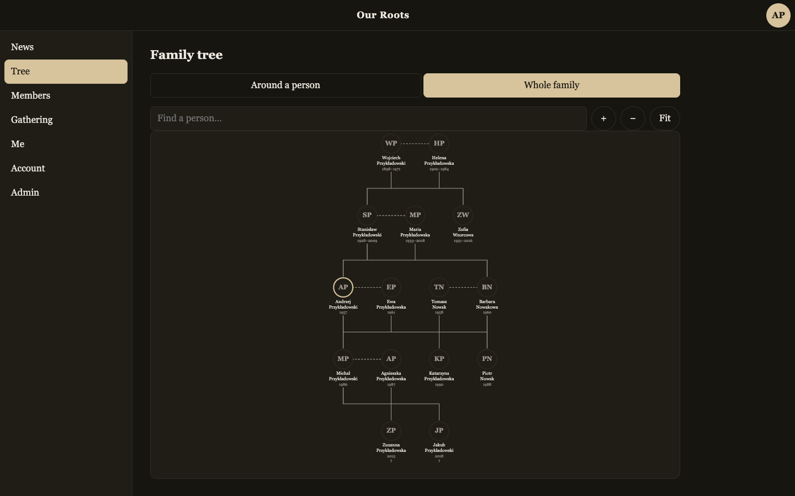

# Our Roots / Nasze Korzenie

[](https://github.com/atrzeciak/shrubbery/actions/workflows/deploy.yml)
[](https://github.com/atrzeciak/shrubbery/actions/workflows/watchdog.yml)
[](LICENSE)

A private family archive, built to outlive the person who runs it.

A family tree, photographs and documents, birthday and anniversary reminders, a gathering with a
guest list, and a backup anyone in the family can take away and open twenty years from now with
nothing but `sqlite3`. In Polish and English.

One Cloudflare Worker, D1 and R2. No build step, no framework, no runtime dependencies — the app in
`public/app/` is plain browser modules, and everything it needs is in this repository.



*Five generations of nobody, in the English half of the interface: the screenshot is seeded with
made-up people, which is the only kind this repository is allowed to show. The surnames are Polish
because the family is; the language is whatever the reader's account is set to. The two names at
the bottom are marked undocumented — the tree distinguishes what somebody has a paper for from
what somebody remembers.*

**The code names no site of its own.** Copy `wrangler.example.toml` to `wrangler.toml`, fill in your
domain, database and bucket, and it is your family's archive. `wrangler.toml` is git-ignored for
exactly that reason.

## Quick start

```sh
cp wrangler.example.toml wrangler.toml     # then edit it
make install                                # npm ci, exactly as CI does it
make check                                  # verify, lint, then the full test suite
make dev                                    # http://localhost:8787
```

`make help` lists the rest. The full setup — D1, R2, mail, the first account, secrets — is in
[DEVELOPER_GUIDE.md](DEVELOPER_GUIDE.md).

## Documentation

| Document | What is in it |
| -------- | ------------- |
| [ARCHITECTURE.md](ARCHITECTURE.md) | Routes, data model, scheduled work, security, configuration |
| [DEVELOPER_GUIDE.md](DEVELOPER_GUIDE.md) | Standing one up, secrets, deploying, operations, troubleshooting |
| [CLAUDE.md](CLAUDE.md) | Build commands, project structure, conventions |
| [CONTRIBUTING.md](CONTRIBUTING.md) | What contributions are welcome, the checks, the conventions |
| [SECURITY.md](SECURITY.md) | Reporting a vulnerability, and what is already known and accepted |

## What makes it unusual

Most of the design went into the parts that matter only once, years from now, when nobody is paying
attention:

- **The archive is the point.** One ZIP holds the database as plain SQL, every photograph and
  document, and instructions for rebuilding without any of this code. A test restores that dump on
  every commit.
- **The site watches its own survival** — the domain's renewal date, the card behind the account,
  how long since anyone took a backup — and writes to the admins on the first of every month. The
  letter's *absence* is meant to be the alarm.
- **A watchdog runs outside Cloudflare**, because nothing inside Cloudflare can report that
  Cloudflare stopped.
- **Warnings are worked out when read, never trusted from storage**, so a row that froze when a cron
  died cannot keep reading as calm.
- **Two admins on two mail providers** is a documented precondition, not a nicety.

## Testing

```sh
make test
```

`vitest` on `@cloudflare/vitest-pool-workers`: real D1, real R2, the real Workers runtime. Tests run
against `wrangler.example.toml`, so they can never depend on anybody's real configuration. The
browser modules run under `happy-dom` in a second project; `make coverage` prints the table.

## Licence

MIT — see [LICENSE](LICENSE). It is a family archive: the code is worth sharing even though the
contents never are.
